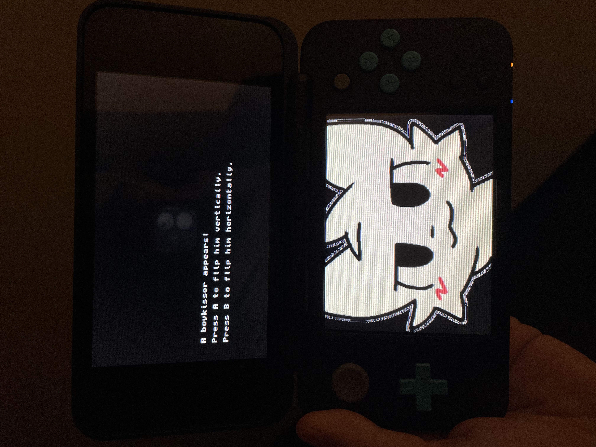

# boykisser-3ds
A silly little Rust Homebrew program for the 3ds.

# Media

https://github.com/Chloe-Woahie/boykisser-3ds/assets/68732833/bbb67a54-ff9f-4b41-ac45-3446a11098f5

# Usage
This is somewhat a complicated process that I had to come up with through trial-and-error. This is because these tools were primarily written for use on Linux. This guide has been written only for Windows users as I do not have an easy way of testing steps on other platforms. 

## Downloading Prerequisites

### devkitPro
1. On windows, download the graphical installer for devkitpro [here](https://github.com/devkitPro/installer/releases). Run this and have it install everything. Preferably, install it to `C:\devkitPro` (the default path) so the rest of the guide is easier to follow. This will take a bit.
2. Set environment variable `DEVKITPRO` to `C:\devkitPro`. Set environment variable `DEVKITARM` to `C:\devkitPro\devkitARM`. Set environment variable `DEVKITPPC` to `C:\devkitPro\devkitPPC`. 
3. Add `C:\devkitPro\devkitARM\bin` to your PATH so that your system can find linkers.
4. Make sure that `smdhtool` is part of your path by adding `C:\devkitPro\tools\bin` to your PATH.

### cargo-3ds
1. To install cargo-3ds, run `$ cargo install --locked cargo-3ds`. If you run into errors, make sure rust is updated and on stable.
2. Switch to rust nightly with `$ rustup override set nightly`. You need this to be able to run cargo-3ds.

### LLVM
1. Make sure LLVM is installed. You can do this by downloading the Windows executable from [here](https://github.com/llvm/llvm-project/releases). Make sure that when you install it, you check the box that creates a path for all users.

## Building
To build the program, run `$ cargo 3ds build --release`. The finished 3dsx file will be in boykisser-3ds/target/armv6k-nintendo-3ds/release/boykisser-3ds.

# Disclaimer
I am not involved with Nintendo in any way.
